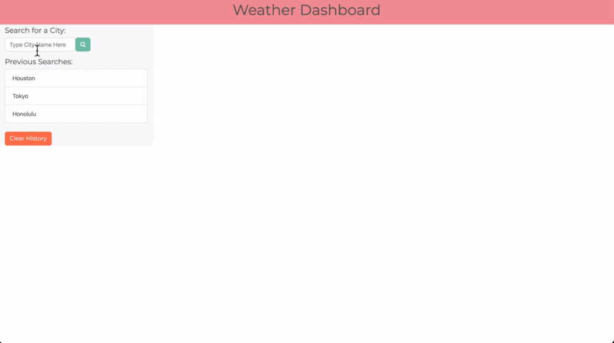

# [Weather Dashboard](https://corgimaman.github.io/weather-dashboard/)

This is a weather dashboard to help find the current weather and a five day forecast for any city in the world. This application uses a server-side API provided by [WeatherBit](https://www.weatherbit.io/).

The current weather has an icon to show conditions, as well as temperature (actual and feels like), humidity, chance of rain, and the UV index. The UV index will display in green if under 3, yellow if over 3 and under 7, and in a danger color if over 7.

## How to Use

To use, type in the city name into the search bar and press enter or click the search icon. Your city will be saved into local storage until cleared.

### What did I learn:
This project put me to work to understanding Bootstrap as well as using fetch calls to third party APIs to retrieve data. 

#### Future Development
- Some sort of on click listener to change from Fahrenheit to Celsius.
- Dark mode
- Weather alerts
